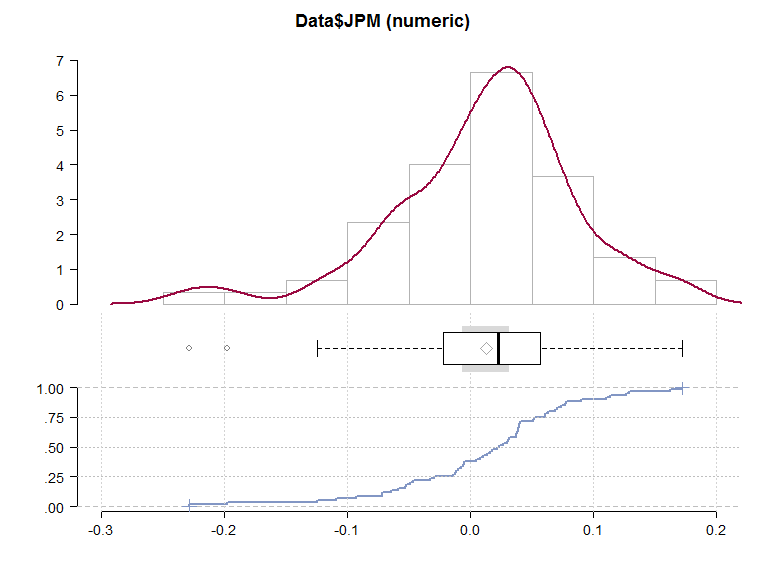
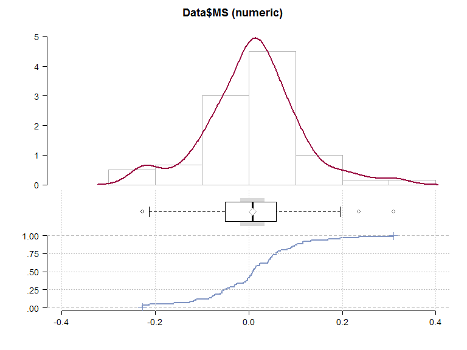
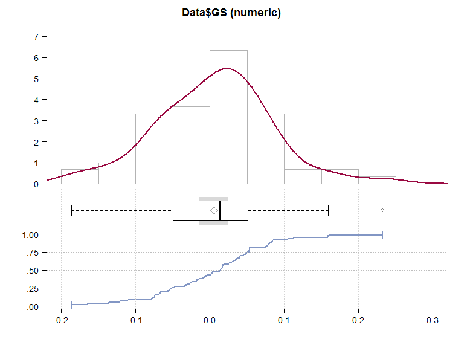
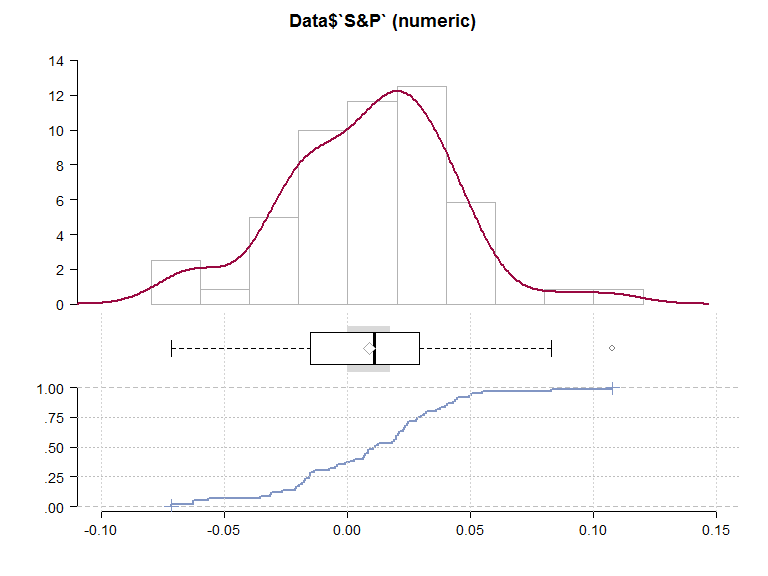

# Finance in R
Patrick Wynne  
April 1, 2016  

##Loading packages and importing data


```r
library(dplyr)
library(tidyr)
library(repmis)
library(stargazer)
library(knitr)
library(ggplot2)

#import files from dropbox

Data <- source_DropboxData(file = "FinanceExample.csv", 
                              key = "x61awpr4vqvi97y", header = TRUE)
```

## JP Morgan {.smaller}


```r
library(DescTools)

Desc(Data$JPM, plotit = TRUE)
```

```
## ------------------------------------------------------------------------- 
## Data$JPM (numeric)
## 
##           length               n             NAs          unique              0s            mean          meanSE
##            6e+01           6e+01               0             = n               0   1.2441417e-02   9.6865247e-03
## 
##              .05             .10             .25          median             .75             .90             .95
##   -1.0981335e-01  -7.1466600e-02  -1.8257500e-02   2.2488500e-02   5.4154500e-02   9.1957600e-02   1.2700690e-01
## 
##            range              sd           vcoef             mad             IQR            skew            kurt
##    4.0047400e-01   7.5031498e-02   6.0307841e+00   5.5582674e-02   7.2412000e-02  -6.8720199e-01   1.2659795e+00
##  
## lowest : -2.2871100e-01, -1.9808300e-01, -1.2464000e-01, -1.0903300e-01, -9.3307000e-02
## highest: 1.1385400e-01, 1.2688500e-01, 1.2932300e-01, 1.6235100e-01, 1.7176300e-01
```

 


##Morgan Stanley {.smaller}


```r
Desc(Data$MS, plotit = TRUE)
```

```
## ------------------------------------------------------------------------- 
## Data$MS (numeric)
## 
##           length               n             NAs          unique              0s            mean          meanSE
##            6e+01           6e+01               0             = n               0   8.5058333e-03   1.2973768e-02
## 
##              .05             .10             .25          median             .75             .90             .95
##   -1.6416090e-01  -1.1348690e-01  -4.9021500e-02   8.5510000e-03   5.8755000e-02   1.1585690e-01   1.7058920e-01
## 
##            range              sd           vcoef             mad             IQR            skew            kurt
##    5.3740000e-01   1.0049437e-01   1.1814759e+01   7.6460647e-02   1.0777650e-01   9.1031374e-02   9.4891369e-01
##  
## lowest : -2.2800000e-01, -2.2685200e-01, -2.1348300e-01, -1.6156500e-01, -1.2603100e-01
## highest: 1.3337300e-01, 1.6930000e-01, 1.9508400e-01, 2.3595500e-01, 3.0940000e-01
```

 

##Goldman Sachs {.smaller}


```r
Desc(Data$GS, plotit = TRUE)
```

```
## ------------------------------------------------------------------------- 
## Data$GS (numeric)
## 
##            length                n              NAs           unique               0s             mean           meanSE
##             6e+01            6e+01                0              = n                0   5.20830000e-03   9.97777684e-03
## 
##               .05              .10              .25           median              .75              .90              .95
##   -1.22498800e-01  -7.72981000e-02  -4.87722500e-02   1.33680000e-02   5.00182500e-02   8.30992000e-02   1.15308900e-01
## 
##             range               sd            vcoef              mad              IQR             skew             kurt
##    4.19123000e-01   7.72875270e-02   1.48393002e+01   5.97836211e-02   9.87905000e-02   6.93340585e-02   5.43165302e-01
##  
## lowest : -1.86457000e-01, -1.64915000e-01, -1.36327000e-01, -1.21771000e-01, -1.10509000e-01
## highest: 1.04286000e-01, 1.13028000e-01, 1.58646000e-01, 1.59141000e-01, 2.32666000e-01
```

 


##S&P {.smaller}


```r
Desc(Data$`S&P`, plotit = TRUE)
```

```
## ------------------------------------------------------------------------- 
## Data$`S&P` (numeric)
## 
##            length                n              NAs           unique               0s             mean           meanSE
##             6e+01            6e+01                0              = n                0   8.68396667e-03   4.35977031e-03
## 
##               .05              .10              .25           median              .75              .90              .95
##   -5.70805000e-02  -3.10667000e-02  -1.51885000e-02   1.07760000e-02   2.88085000e-02   4.36843000e-02   5.06512500e-02
## 
##             range               sd            vcoef              mad              IQR             skew             kurt
##    1.79485000e-01   3.37706356e-02   3.88884906e+00   3.36980154e-02   4.39970000e-02  -2.01378931e-02   5.06512571e-01
##  
## lowest : -7.17620000e-02, -6.26510000e-02, -6.25810000e-02, -5.67910000e-02, -3.55830000e-02
## highest: 4.94620000e-02, 5.04280000e-02, 5.48930000e-02, 8.29830000e-02, 1.07723000e-01
```

 

##Correlation Matrix


```r
CorrelationMatrix <- cor(Data[2:5])

stargazer(CorrelationMatrix, type = "html")
```


<table style="text-align:center"><tr><td colspan="5" style="border-bottom: 1px solid black"></td></tr><tr><td style="text-align:left"></td><td>JPM</td><td>MS</td><td>GS</td><td>S&P</td></tr>
<tr><td colspan="5" style="border-bottom: 1px solid black"></td></tr><tr><td style="text-align:left">JPM</td><td>1</td><td>0.864</td><td>0.858</td><td>0.750</td></tr>
<tr><td style="text-align:left">MS</td><td>0.864</td><td>1</td><td>0.903</td><td>0.769</td></tr>
<tr><td style="text-align:left">GS</td><td>0.858</td><td>0.903</td><td>1</td><td>0.740</td></tr>
<tr><td style="text-align:left">S&P</td><td>0.750</td><td>0.769</td><td>0.740</td><td>1</td></tr>
<tr><td colspan="5" style="border-bottom: 1px solid black"></td></tr></table>

##Simple Regression JPM


```r
JPM_SimpleRegression <- lm(JPM-rf ~ `S&P-rf`, data = Data)

stargazer(JPM_SimpleRegression, type = "html", title = "JPM Versus S&P-rf")
```


<table style="text-align:center"><caption><strong>JPM Versus S&P-rf</strong></caption>
<tr><td colspan="2" style="border-bottom: 1px solid black"></td></tr><tr><td style="text-align:left"></td><td><em>Dependent variable:</em></td></tr>
<tr><td></td><td colspan="1" style="border-bottom: 1px solid black"></td></tr>
<tr><td style="text-align:left"></td><td>JPM - rf</td></tr>
<tr><td colspan="2" style="border-bottom: 1px solid black"></td></tr><tr><td style="text-align:left">`S&P-rf`</td><td>1.667<sup>***</sup></td></tr>
<tr><td style="text-align:left"></td><td>(0.193)</td></tr>
<tr><td style="text-align:left"></td><td></td></tr>
<tr><td style="text-align:left">Constant</td><td>-0.002</td></tr>
<tr><td style="text-align:left"></td><td>(0.007)</td></tr>
<tr><td style="text-align:left"></td><td></td></tr>
<tr><td colspan="2" style="border-bottom: 1px solid black"></td></tr><tr><td style="text-align:left">Observations</td><td>60</td></tr>
<tr><td style="text-align:left">R<sup>2</sup></td><td>0.563</td></tr>
<tr><td style="text-align:left">Adjusted R<sup>2</sup></td><td>0.555</td></tr>
<tr><td style="text-align:left">Residual Std. Error</td><td>0.050 (df = 58)</td></tr>
<tr><td style="text-align:left">F Statistic</td><td>74.669<sup>***</sup> (df = 1; 58)</td></tr>
<tr><td colspan="2" style="border-bottom: 1px solid black"></td></tr><tr><td style="text-align:left"><em>Note:</em></td><td style="text-align:right"><sup>*</sup>p<0.1; <sup>**</sup>p<0.05; <sup>***</sup>p<0.01</td></tr>
</table>


##Simple Regression MS


```r
MS_SimpleRegression <- lm(MS-rf ~ `S&P-rf`, data = Data)

stargazer(MS_SimpleRegression, type = "html", title = "MS Versus S&P-rf")
```


<table style="text-align:center"><caption><strong>MS Versus S&P-rf</strong></caption>
<tr><td colspan="2" style="border-bottom: 1px solid black"></td></tr><tr><td style="text-align:left"></td><td><em>Dependent variable:</em></td></tr>
<tr><td></td><td colspan="1" style="border-bottom: 1px solid black"></td></tr>
<tr><td style="text-align:left"></td><td>MS - rf</td></tr>
<tr><td colspan="2" style="border-bottom: 1px solid black"></td></tr><tr><td style="text-align:left">`S&P-rf`</td><td>2.288<sup>***</sup></td></tr>
<tr><td style="text-align:left"></td><td>(0.250)</td></tr>
<tr><td style="text-align:left"></td><td></td></tr>
<tr><td style="text-align:left">Constant</td><td>-0.011</td></tr>
<tr><td style="text-align:left"></td><td>(0.009)</td></tr>
<tr><td style="text-align:left"></td><td></td></tr>
<tr><td colspan="2" style="border-bottom: 1px solid black"></td></tr><tr><td style="text-align:left">Observations</td><td>60</td></tr>
<tr><td style="text-align:left">R<sup>2</sup></td><td>0.591</td></tr>
<tr><td style="text-align:left">Adjusted R<sup>2</sup></td><td>0.584</td></tr>
<tr><td style="text-align:left">Residual Std. Error</td><td>0.065 (df = 58)</td></tr>
<tr><td style="text-align:left">F Statistic</td><td>83.897<sup>***</sup> (df = 1; 58)</td></tr>
<tr><td colspan="2" style="border-bottom: 1px solid black"></td></tr><tr><td style="text-align:left"><em>Note:</em></td><td style="text-align:right"><sup>*</sup>p<0.1; <sup>**</sup>p<0.05; <sup>***</sup>p<0.01</td></tr>
</table>


##Simple Regression GS


```r
GS_SimpleRegression <- lm(GS-rf ~ `S&P-rf`, data = Data)

stargazer(GS_SimpleRegression, type = "html", title = "GS Versus S&P-rf")
```


<table style="text-align:center"><caption><strong>GS Versus S&P-rf</strong></caption>
<tr><td colspan="2" style="border-bottom: 1px solid black"></td></tr><tr><td style="text-align:left"></td><td><em>Dependent variable:</em></td></tr>
<tr><td></td><td colspan="1" style="border-bottom: 1px solid black"></td></tr>
<tr><td style="text-align:left"></td><td>GS - rf</td></tr>
<tr><td colspan="2" style="border-bottom: 1px solid black"></td></tr><tr><td style="text-align:left">`S&P-rf`</td><td>1.694<sup>***</sup></td></tr>
<tr><td style="text-align:left"></td><td>(0.202)</td></tr>
<tr><td style="text-align:left"></td><td></td></tr>
<tr><td style="text-align:left">Constant</td><td>-0.009</td></tr>
<tr><td style="text-align:left"></td><td>(0.007)</td></tr>
<tr><td style="text-align:left"></td><td></td></tr>
<tr><td colspan="2" style="border-bottom: 1px solid black"></td></tr><tr><td style="text-align:left">Observations</td><td>60</td></tr>
<tr><td style="text-align:left">R<sup>2</sup></td><td>0.548</td></tr>
<tr><td style="text-align:left">Adjusted R<sup>2</sup></td><td>0.540</td></tr>
<tr><td style="text-align:left">Residual Std. Error</td><td>0.052 (df = 58)</td></tr>
<tr><td style="text-align:left">F Statistic</td><td>70.310<sup>***</sup> (df = 1; 58)</td></tr>
<tr><td colspan="2" style="border-bottom: 1px solid black"></td></tr><tr><td style="text-align:left"><em>Note:</em></td><td style="text-align:right"><sup>*</sup>p<0.1; <sup>**</sup>p<0.05; <sup>***</sup>p<0.01</td></tr>
</table>


##Multiple Regression JPM


```r
JPM_MultipleRegression <- lm(JPM-rf  ~ mktrf + smb + hml, data = Data)

stargazer(JPM_MultipleRegression, type = "html", title = "Multiple Regression on JPM")
```


<table style="text-align:center"><caption><strong>Multiple Regression on JPM</strong></caption>
<tr><td colspan="2" style="border-bottom: 1px solid black"></td></tr><tr><td style="text-align:left"></td><td><em>Dependent variable:</em></td></tr>
<tr><td></td><td colspan="1" style="border-bottom: 1px solid black"></td></tr>
<tr><td style="text-align:left"></td><td>JPM - rf</td></tr>
<tr><td colspan="2" style="border-bottom: 1px solid black"></td></tr><tr><td style="text-align:left">mktrf</td><td>1.585<sup>***</sup></td></tr>
<tr><td style="text-align:left"></td><td>(0.190)</td></tr>
<tr><td style="text-align:left"></td><td></td></tr>
<tr><td style="text-align:left">smb</td><td>0.158</td></tr>
<tr><td style="text-align:left"></td><td>(0.305)</td></tr>
<tr><td style="text-align:left"></td><td></td></tr>
<tr><td style="text-align:left">hml</td><td>0.853<sup>**</sup></td></tr>
<tr><td style="text-align:left"></td><td>(0.358)</td></tr>
<tr><td style="text-align:left"></td><td></td></tr>
<tr><td style="text-align:left">Constant</td><td>-0.001</td></tr>
<tr><td style="text-align:left"></td><td>(0.007)</td></tr>
<tr><td style="text-align:left"></td><td></td></tr>
<tr><td colspan="2" style="border-bottom: 1px solid black"></td></tr><tr><td style="text-align:left">Observations</td><td>60</td></tr>
<tr><td style="text-align:left">R<sup>2</sup></td><td>0.614</td></tr>
<tr><td style="text-align:left">Adjusted R<sup>2</sup></td><td>0.594</td></tr>
<tr><td style="text-align:left">Residual Std. Error</td><td>0.048 (df = 56)</td></tr>
<tr><td style="text-align:left">F Statistic</td><td>29.749<sup>***</sup> (df = 3; 56)</td></tr>
<tr><td colspan="2" style="border-bottom: 1px solid black"></td></tr><tr><td style="text-align:left"><em>Note:</em></td><td style="text-align:right"><sup>*</sup>p<0.1; <sup>**</sup>p<0.05; <sup>***</sup>p<0.01</td></tr>
</table>


##Multiple Regression MS


```r
MS_MultipleRegression <- lm(MS-rf ~ mktrf + smb + hml, data = Data)

stargazer(MS_MultipleRegression, type = "html", title = "Multiple Regression on MS")
```


<table style="text-align:center"><caption><strong>Multiple Regression on MS</strong></caption>
<tr><td colspan="2" style="border-bottom: 1px solid black"></td></tr><tr><td style="text-align:left"></td><td><em>Dependent variable:</em></td></tr>
<tr><td></td><td colspan="1" style="border-bottom: 1px solid black"></td></tr>
<tr><td style="text-align:left"></td><td>MS - rf</td></tr>
<tr><td colspan="2" style="border-bottom: 1px solid black"></td></tr><tr><td style="text-align:left">mktrf</td><td>2.102<sup>***</sup></td></tr>
<tr><td style="text-align:left"></td><td>(0.231)</td></tr>
<tr><td style="text-align:left"></td><td></td></tr>
<tr><td style="text-align:left">smb</td><td>0.702<sup>*</sup></td></tr>
<tr><td style="text-align:left"></td><td>(0.371)</td></tr>
<tr><td style="text-align:left"></td><td></td></tr>
<tr><td style="text-align:left">hml</td><td>1.204<sup>***</sup></td></tr>
<tr><td style="text-align:left"></td><td>(0.436)</td></tr>
<tr><td style="text-align:left"></td><td></td></tr>
<tr><td style="text-align:left">Constant</td><td>-0.009</td></tr>
<tr><td style="text-align:left"></td><td>(0.008)</td></tr>
<tr><td style="text-align:left"></td><td></td></tr>
<tr><td colspan="2" style="border-bottom: 1px solid black"></td></tr><tr><td style="text-align:left">Observations</td><td>60</td></tr>
<tr><td style="text-align:left">R<sup>2</sup></td><td>0.682</td></tr>
<tr><td style="text-align:left">Adjusted R<sup>2</sup></td><td>0.665</td></tr>
<tr><td style="text-align:left">Residual Std. Error</td><td>0.058 (df = 56)</td></tr>
<tr><td style="text-align:left">F Statistic</td><td>40.095<sup>***</sup> (df = 3; 56)</td></tr>
<tr><td colspan="2" style="border-bottom: 1px solid black"></td></tr><tr><td style="text-align:left"><em>Note:</em></td><td style="text-align:right"><sup>*</sup>p<0.1; <sup>**</sup>p<0.05; <sup>***</sup>p<0.01</td></tr>
</table>


##Multiple Regression GS


```r
GS_MultipleRegression <- lm(GS-rf ~ mktrf + smb + hml, data = Data)

stargazer(GS_MultipleRegression, type = "html", title = "Multiple Regression on GS")
```


<table style="text-align:center"><caption><strong>Multiple Regression on GS</strong></caption>
<tr><td colspan="2" style="border-bottom: 1px solid black"></td></tr><tr><td style="text-align:left"></td><td><em>Dependent variable:</em></td></tr>
<tr><td></td><td colspan="1" style="border-bottom: 1px solid black"></td></tr>
<tr><td style="text-align:left"></td><td>GS - rf</td></tr>
<tr><td colspan="2" style="border-bottom: 1px solid black"></td></tr><tr><td style="text-align:left">mktrf</td><td>1.595<sup>***</sup></td></tr>
<tr><td style="text-align:left"></td><td>(0.197)</td></tr>
<tr><td style="text-align:left"></td><td></td></tr>
<tr><td style="text-align:left">smb</td><td>0.362</td></tr>
<tr><td style="text-align:left"></td><td>(0.317)</td></tr>
<tr><td style="text-align:left"></td><td></td></tr>
<tr><td style="text-align:left">hml</td><td>0.667<sup>*</sup></td></tr>
<tr><td style="text-align:left"></td><td>(0.372)</td></tr>
<tr><td style="text-align:left"></td><td></td></tr>
<tr><td style="text-align:left">Constant</td><td>-0.009</td></tr>
<tr><td style="text-align:left"></td><td>(0.007)</td></tr>
<tr><td style="text-align:left"></td><td></td></tr>
<tr><td colspan="2" style="border-bottom: 1px solid black"></td></tr><tr><td style="text-align:left">Observations</td><td>60</td></tr>
<tr><td style="text-align:left">R<sup>2</sup></td><td>0.608</td></tr>
<tr><td style="text-align:left">Adjusted R<sup>2</sup></td><td>0.587</td></tr>
<tr><td style="text-align:left">Residual Std. Error</td><td>0.050 (df = 56)</td></tr>
<tr><td style="text-align:left">F Statistic</td><td>28.972<sup>***</sup> (df = 3; 56)</td></tr>
<tr><td colspan="2" style="border-bottom: 1px solid black"></td></tr><tr><td style="text-align:left"><em>Note:</em></td><td style="text-align:right"><sup>*</sup>p<0.1; <sup>**</sup>p<0.05; <sup>***</sup>p<0.01</td></tr>
</table>


